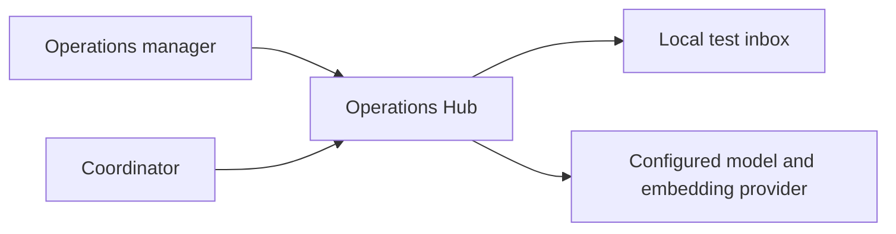
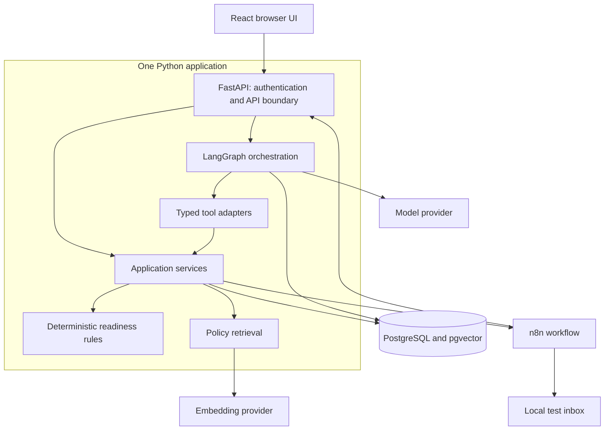

# Architecture: contractor operations readiness

Status: design baseline for the selected workflow; implementation has not started.

Product context: the [public FocusIMS review](FOCUSIMS_RESEARCH.md) identifies existing expiry alerts, task tracking, and operational features that overlap with this demo. Our candidate contribution is easier conversational investigation and controlled action preparation. Incremental client value and real integration compatibility remain unvalidated; this architecture defines an independent synthetic prototype.

## 1. Purpose and constraints

An operations manager needs to identify missing contractor evidence for upcoming jobs and coordinate follow-ups. The [workflow](WORKFLOW.md) defines the fictional policy and expected outcomes. The business value hypothesis remains unvalidated with the client.

Constraints: solo development, synthetic data, one organisation, local test email, small deployment, and incremental delivery. No client integration is required. The architecture must support understandable decisions, enforced permissions, durable approval, and recovery from partial failure.

An architecture describes components, responsibilities, interactions, and constraints. An ADR records why a consequential choice was made, the alternatives considered, and its costs. See the [decision index](decisions/README.md).

## 2. System context



The manager approves actions; the coordinator maintains reviewed evidence. Only necessary synthetic context goes to the model provider. FocusIMS and FocusBIS are domain references, not connected systems in this release.

## 3. Runtime components



The graph checkpoint connection has separate storage ownership from business services. Arrows to PostgreSQL do not grant the model SQL access. Browser requests and n8n service requests enter different authenticated API routes.

| Component | Owns | Must delegate |
| --- | --- | --- |
| Browser | User input, evidence display, exact approval preview | Authorisation and business decisions to server |
| FastAPI boundary | Authentication, input/output schemas, request limits | Business behavior to application services |
| Application services | Record scope, assessment persistence, approval transitions, action ledger | Pure checks to domain functions; integration sequence to n8n |
| Readiness rules | Status, reason codes, evidence references | Data loading and persistence to services |
| LangGraph | Interpretation, clarification, tool coordination, explanation | Readiness and permission decisions to services |
| Retrieval | Versioned, scoped policy passages | Policy requirements to approved structured configuration |
| n8n | Approved workflow sequence and step reporting | Task writes and approval validation to business API |
| PostgreSQL | Durable records, constraints, snapshots, checkpoints | Business authority to application code |

Initially implement only the rules and API. Add the remaining components at their scheduled milestones. Internal tools call the same services as API routes; unnecessary HTTP between modules in the same process is avoided.

## 4. Read path: an assessment

1. Authenticate the user and derive organisation scope on the server.
2. Validate the requested date range. Natural-language requests first resolve to an explicit range using the displayed reference time and timezone.
3. Load authorised jobs and their assignments, requirement versions, and reviewed evidence.
4. Run `assess(job, documents, policy)` with explicit inputs. The function returns findings without side effects.
5. Persist the assessment and source versions. Return structured findings even if the model or retrieval is unavailable.
6. Optionally retrieve matching policy passages and generate an explanation. A missing passage yields an explanation limitation; it does not change the rule result.

For JOB-102, insurance ends before the job ends. Code emits `EXPIRES_BEFORE_JOB_END`; AI can explain that result but cannot override it.

## 5. Write path: approved follow-up

```mermaid
sequenceDiagram
    participant U as Manager
    participant A as Application
    participant D as PostgreSQL
    participant N as n8n
    participant I as Test inbox
    U->>A: Approve exact action version
    A->>D: Validate role, sources, expiry; persist approval
    A->>N: Dispatch approved action ID
    N->>A: Claim action using service identity
    A->>D: Atomically revalidate and claim execution
    A-->>N: Stored approved payload
    N->>A: Create task with action ID
    A->>D: Insert or return existing task
    N->>I: Deliver approved message
    N->>A: Record step outcome and receipt
    U->>A: Read verified task and delivery state
```

Approval and execution claiming are database transactions. Database writes and email delivery are separate operations; there is no shared transaction across them. Recheck sources at the execution claim. Changes committed after that claim are recorded for later reassessment; we cannot atomically lock an external delivery against all future evidence changes.

The durable action ledger records pending dispatch. Failed dispatch is discoverable and retryable by action ID. The precise polling/recovery mechanism remains a Day 18 implementation choice; volatile in-process background tasks alone do not meet the recovery requirement.

## 6. State and data ownership

| Records | Purpose | Writer |
| --- | --- | --- |
| Jobs, assignments, contractors, evidence | Operational facts with versions | Authorised application services |
| Requirement sets and policy text | Structured rules and explanatory documents sharing a version | Controlled policy publication path |
| Assessments and findings | Point-in-time result and source references | Assessment service |
| Draft versions and approvals | Exact proposed action and authorising decision | Proposal/approval services |
| Action ledger, tasks, deliveries | Execution and recovery state | Authenticated execution services |
| Audit events | Actor, time, action, source versions, outcome | Application services |
| Graph checkpoints | Conversation and interrupted graph progress | Checkpoint adapter |
| Policy chunks and vectors | Rebuildable retrieval index | Ingestion process |

Business records are authoritative. Checkpoints describe orchestration progress and cannot authorise an action. Vector search is a derived index and cannot establish current expiry dates or job status.

Keep readiness, approval, task, and delivery states distinct. A successful notification does not make evidence valid. Store audit timestamps in UTC; evaluate policy validity using local calendar dates as specified in the workflow.

## 7. Trust boundaries and invariants

- Browser text, model output, and retrieved content are untrusted inputs.
- Every record read, graph resume, approval, and execution checks server-derived scope.
- Only a manager may approve; workflow credentials cannot grant approval.
- Execution uses the stored approved payload. New recipient/body arguments cannot replace it.
- A changed payload requires new approval; changed source versions require reassessment.
- State-changing actions have durable IDs and database uniqueness constraints.
- Expose selected findings and audit metadata in the UI, not hidden reasoning or raw secrets.
- n8n editor, database, and test inbox remain private. The workflow service receives only needed privileges.

## 8. Failure handling

| Failure | Required behavior |
| --- | --- |
| Model unavailable | Structured assessment remains available; explanation shows unavailable |
| Policy retrieval empty | Report the limitation; never invent a requirement |
| Restart during approval | Reconstruct pending approval from durable state |
| Dispatch response lost | Query/retry using action ID; never create another logical action |
| Task created, email fails | Retain task and recover delivery separately |
| Email acknowledgement lost | Mark unknown; reconcile or request operator review before resending |
| Evidence changes before execution claim | Invalidate stale proposal and reassess |
| Database unavailable | Fail without claiming persistence or successful execution |

Do not claim exactly-once email delivery merely because the database task is idempotent. The transport's capabilities constrain that guarantee.

## 9. Deployment and verification

Local target: Docker Compose for PostgreSQL, n8n, and the inbox; app processes may run directly during development. Hosted target: simple HTTPS deployment with private internal services, injected secrets, backups, and a named operator. Hosting provider and auth implementation are still open decisions.

Test layers: pure rule tests; service/database tests for ownership and atomic transitions; API tests; workflow failure/replay tests; model evaluation; deployed restore and rollback exercises. The measurable release criteria remain in [PROJECT_PLAN.md](../PROJECT_PLAN.md).

Trace a request using request, assessment, action, and workflow IDs. Record durations, source versions, tool outcomes, approval events, delivery receipts, and model usage with sensitive content redacted.

## 10. Open decisions and review triggers

| Decision | Resolve by | Evidence needed |
| --- | --- | --- |
| Auth provider/library and session design | Day 6 | Local/hosted setup, role support, maintenance cost |
| Provider/model and budget | Day 11 | Quality on our cases, latency, cost, data handling |
| Job selection: starts within vs overlaps requested window | Before Day 4 rules/API contract | Expected operator meaning and boundary examples |
| Dispatch recovery mechanism | Day 18 | Restart and lost-response exercises |
| Hosting and resource limits | Day 20 | Budget, load measurements, recovery requirements |

Create or supersede an ADR when a consequential decision changes. Update diagrams when the implementation differs. Split services only when observed deployment, scaling, or ownership needs justify the extra operational cost.
